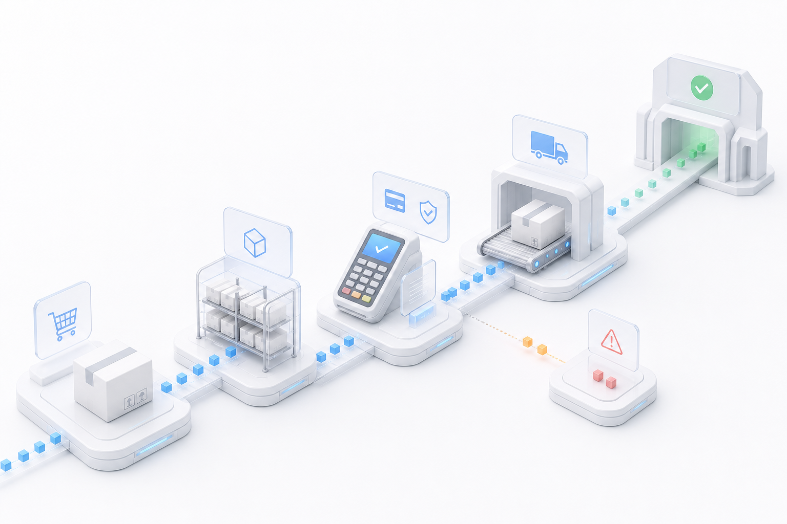
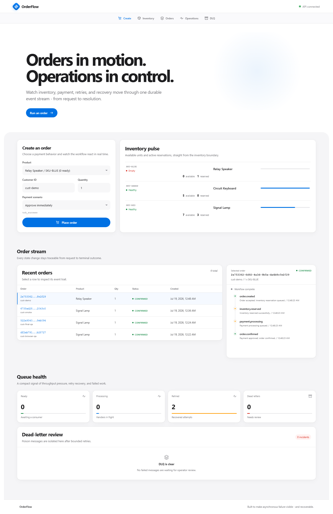
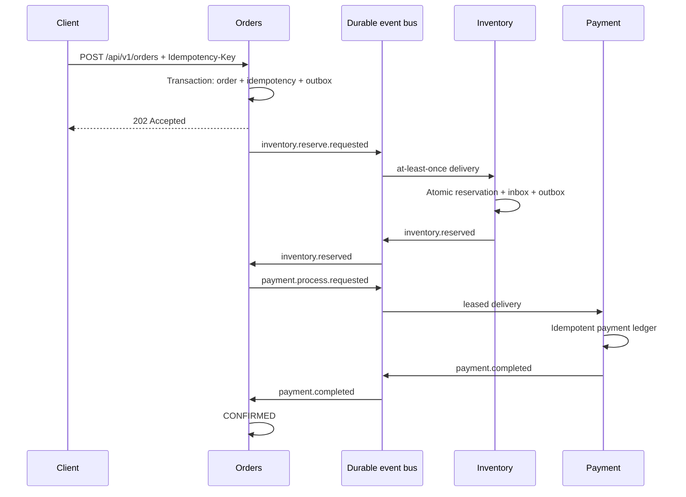
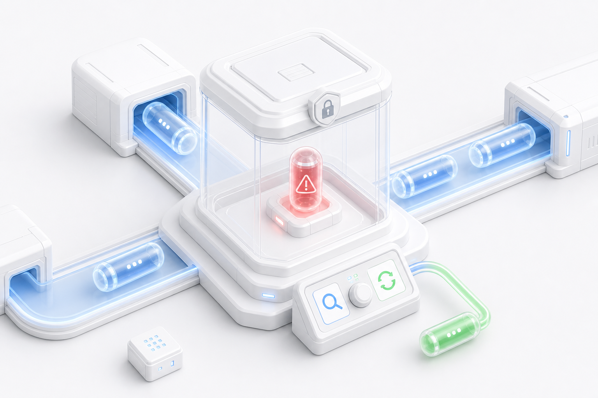

# OrderFlow — Event-Driven Order & Inventory Platform



[](https://github.com/TarunT27/orderflow-event-platform/actions/workflows/ci.yml)

OrderFlow is a production-minded reference implementation of an asynchronous order saga. A request is accepted once, stock is reserved atomically, a deterministic payment provider is invoked, and the final order state is reached through durable events. Transient failures retry with capped exponential backoff; poison work is isolated in a dead-letter queue and exposed through an operations dashboard for review and redrive.

The default runtime intentionally needs only Node.js. Order, inventory, payment, and broker state live in separate SQLite databases, making the demo reliable on laptops and CI without hiding the important distributed-systems patterns behind infrastructure setup.

## What it demonstrates

- Explicit Order, Inventory, Payment, Messaging, and API Gateway boundaries
- Versioned event envelopes with correlation and causation IDs
- Transactional outbox and idempotent inbox consumers
- Atomic, constraint-backed inventory reservations
- Request idempotency with canonical SHA-256 fingerprints
- Deterministic payment success, decline, retry, and poison scenarios
- Capped exponential backoff, delivery leases, DLQ inspection, and operator redrive
- Compensating inventory release after a payment decline
- Structured HTTP errors, validation, rate limits, health checks, and Prometheus metrics
- Unit, integration, API workflow, and Playwright browser tests
- Docker packaging and a concrete AWS migration map

## Quick start

Requirements: Node.js 22.5 or newer.

```bash
npm install
npm run build
npm start
```

Open [http://localhost:4000](http://localhost:4000). Runtime database files are created under `data/` and ignored by Git.



For backend watch mode after one web build:

```bash
npm run dev
```

Run the quality gates:

```bash
npm run verify
npm run test:e2e
```

Docker is optional. The Compose profile builds the production image, binds it to
localhost only, runs as a non-root user with all Linux capabilities dropped, and
persists the four SQLite databases in the `orderflow-data` volume:

```bash
docker compose config --quiet
docker compose up --build --wait
node scripts/docker-smoke.mjs --restart
```

Open [http://localhost:4000](http://localhost:4000). The smoke test exercises
health checks, inventory, a retrying payment, idempotent order replay, graceful
container restart, and database persistence. Stop the service without deleting
its data with `docker compose down`; add `--volumes` only when you intentionally
want to reset the demo databases.

This SQLite deployment is intentionally single-replica. Before backing it up,
stop the container cleanly so its database and WAL files are captured together.
The image itself defaults `DEMO_MODE` to `false`; Compose enables the operations
and DLQ controls explicitly for this localhost-only demonstration.

## Deterministic demo scenarios

| Payment token | Result |
|---|---|
| `tok_success` | Approves immediately and confirms the order |
| `tok_retry_twice` | Fails twice transiently, retries safely, then confirms |
| `tok_decline` | Declines permanently, releases stock, and fails the order |
| `tok_always_error` | Exhausts three deliveries and enters the DLQ |

These values are scenario selectors, not credentials. The server calculates prices; clients cannot submit a price or total.

## Order journey



When payment is declined, Orders emits `inventory.release.requested`; Inventory releases the reservation once and the saga finishes as `FAILED`.

## Repository map

```text
src/
  gateway/             REST API, validation, rate limits, metrics
  services/orders/     idempotency, order saga, immutable history
  services/inventory/  stock constraints and reservations
  services/payments/   deterministic provider and payment ledger
  shared/              contracts, SQLite, durable queue, retry policy
web/                   React operations dashboard
tests/                 unit, integration, API, and browser tests
docs/                  architecture, API, AWS plan, incident runbook
```

Each service owns its database. No service reads another service's tables; coordination occurs through versioned events. The compact local runtime schedules the services in one Node process for a one-command demo, while preserving boundaries that can be deployed independently.

## API example

```bash
curl -X POST http://localhost:4000/api/v1/orders \
  -H "Content-Type: application/json" \
  -H "Idempotency-Key: demo-order-001" \
  -d '{"customerId":"customer-123","sku":"SKU-RED","quantity":2,"paymentToken":"tok_retry_twice"}'
```

Core endpoints:

- `POST /api/v1/orders`
- `GET /api/v1/orders`
- `GET /api/v1/orders/:id`
- `GET /api/v1/products`
- `GET /api/v1/ops`
- `POST /api/v1/ops/dlq/:id/redrive`
- `GET /health/live`, `GET /health/ready`, `GET /metrics`

See [API documentation](docs/api.md) and [OpenAPI](docs/openapi.yaml).

## Failure and incident demo



Create an order with `tok_always_error`. After three delivery attempts, the payment command appears in the dashboard's incident panel. Review its correlation ID and sanitized error, then redrive it with the success override. The original dead letter remains an immutable audit record marked as redriven, while the replacement event carries a new ID and causation link.

The full procedure is in the [incident runbook](docs/incident-runbook.md).

## Design notes

- SQLite is a deliberate local-first broker and datastore, not the recommended multi-host production database.
- Delivery is at least once. Correctness comes from stable event IDs, inbox constraints, semantic state guards, unique payment/reservation keys, and atomic transactions.
- The API has no end-user authentication because it is a focused systems demo. Set `DEMO_MODE=false` to hide operations endpoints. Add API Gateway/Cognito or equivalent before public deployment.
- `tok_*` values must never be replaced with raw card data. A real payment integration should use a provider token plus `orderId:CHARGE` as its provider idempotency key.

See [Architecture](docs/architecture.md), [AWS deployment map](docs/aws-deployment.md), and [Security](SECURITY.md).

## License

MIT
