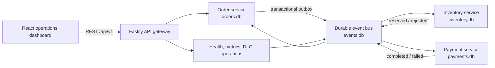
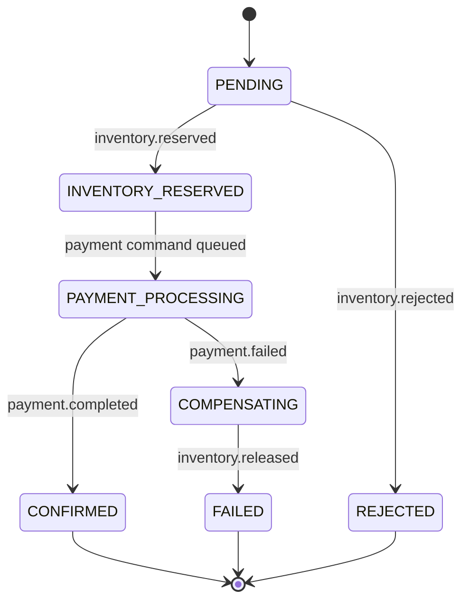

# Architecture

## Context

OrderFlow is an orchestrated saga. The Order service owns the public workflow state, Inventory owns stock and reservations, Payment owns the simulated charge ledger, and the durable event bus owns delivery state. Each service has an isolated SQLite database in the local runtime.



The compact local scheduler runs these boundaries in one process. The services do not share tables or call each other's repositories. This keeps the demo easy to run while preserving migration seams for independent workers or ECS tasks.

## Correctness boundaries

### HTTP idempotency

`POST /api/v1/orders` requires an `Idempotency-Key`. The Order transaction stores a canonical SHA-256 request fingerprint, the order, initial history entry, and initial outbox event. The same key and payload returns the original order. A changed payload returns `409`.

### Transactional outbox

Business state and outgoing events commit together in each service database. An outbox publisher copies unpublished rows to the durable bus using the event ID as a uniqueness key, then marks the outbox row published. Publishing twice is harmless.

### Consumer inbox

Each handler claims `(consumer, event_id)` in the same transaction as its business change and outgoing events. A redelivered event is acknowledged without replaying business effects.

### Inventory invariant

The database enforces:

```text
on_hand >= 0
0 <= reserved <= on_hand
available = on_hand - reserved
```

A conditional update reserves only when `on_hand - reserved >= requested`. `reservations.order_id` is unique, and release is a guarded `RESERVED -> RELEASED` transition.

### Payment invariant

`payments.order_id` is unique. A duplicate payment command cannot create a second simulated charge. Transient attempts are recorded separately and the inbox is claimed only when a terminal payment result commits.

## State machine



Illegal transitions fail closed. Every valid transition appends an immutable history row.

## Delivery, retry, and DLQ

Queue messages are leased. If a worker dies before acknowledging, an expired lease returns the message to the queue. A handler failure increments its attempt and schedules capped exponential backoff. After `MAX_DELIVERY_ATTEMPTS` the message becomes `dead` with a sanitized last-error string.

Business failures such as insufficient stock and card decline are events, not infrastructure errors, so they are acknowledged immediately and advance the saga.

## Event envelope

Every event includes a stable ID, topic, source, aggregate ID, correlation ID, optional causation ID, UTC timestamp, schema version, and JSON data. The order ID is the normal correlation ID.

## Trade-offs

- SQLite makes the complete system runnable without Docker. It is excellent for the reference runtime but not a multi-host message broker.
- The local publisher and services share a process scheduler. Crashes still exercise durable recovery, but production should run independent consumers.
- Metrics are intentionally low-cardinality. Per-order and per-event detail belongs in logs and the operations API.
- Authentication and a real payment provider are out of scope; production mappings are documented rather than implied.
