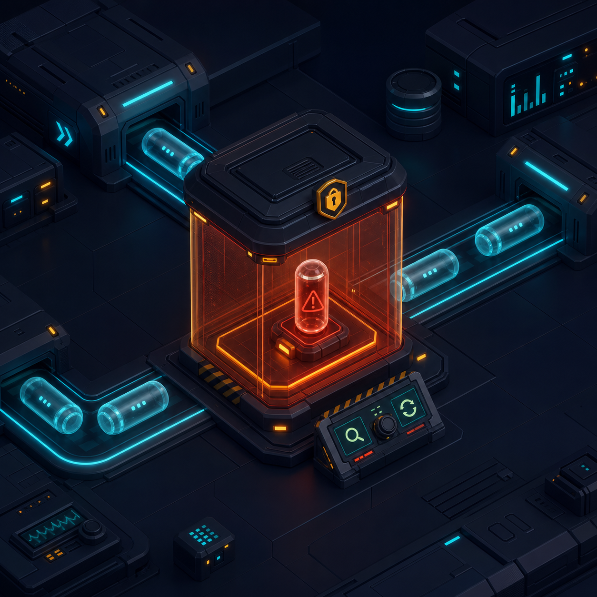

# Dead-letter queue incident runbook



## Trigger

Investigate whenever `orderflow_queue_messages{status="dead"}` is greater than zero or the dashboard incident panel reports a dead letter.

## Triage

1. Open `/api/v1/ops` or the dashboard Incident Desk.
2. Record the event ID, topic, aggregate/order ID, correlation ID, attempt count, and sanitized last error.
3. Read the corresponding order history. Confirm whether a business side effect already committed.
4. Classify the failure:
   - deterministic demo outage (`tok_always_error`);
   - malformed or unsupported event;
   - database or worker availability;
   - invariant or illegal state transition.
5. Do not redrive until the cause is understood. A DLQ is containment, not a retry button.

## Demo recovery

For a payment provider outage in the local demo, choose **Redrive as success** in the dashboard or call:

```bash
curl -X POST http://localhost:4000/api/v1/ops/dlq/EVENT_ID/redrive \
  -H "Content-Type: application/json" \
  -d '{"paymentToken":"tok_success"}'
```

The original dead letter is retained as a completed audit record. The replacement event gets a new ID and points to the original through `causationId`. Payment uniqueness and consumer inboxes keep the redrive safe.

## Validation after redrive

- Order leaves `PAYMENT_PROCESSING` and becomes `CONFIRMED`.
- Exactly one payment row exists for the order.
- Inventory remains reserved for the confirmed order.
- DLQ depth returns to zero.
- Retry and completed counters reflect the incident history.

## When not to redrive

- The payload is invalid or its schema version is unsupported.
- The business action is no longer desired.
- A real provider reports an ambiguous payment. Reconcile by provider idempotency key first.
- The invariant failure has not been fixed.

## Production notes

Restrict redrive authorization, record actor and ticket IDs, rate-limit operations, and require a second reviewer for payment-related messages. Use an SQS DLQ alarm, CloudWatch logs filtered by correlation ID, and a runbook automation that previews—but never automatically executes—the redrive.
